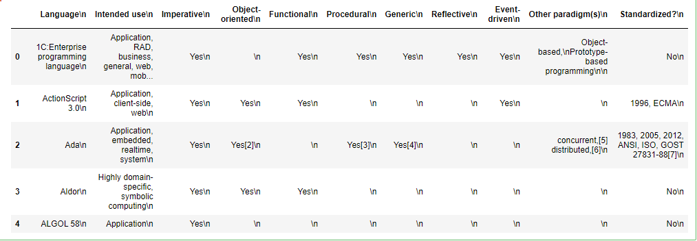

You can find and get examples with code source on these repositories 👀

[](https://facesar.github.io/)

[](https://facesar.github.io/machine-learning-codes/)

[](https://facesar.github.io/roses-javascripts-examples/)

[](https://facesar.github.io/php-source-codes/)
# PYTHON 

Python is a programming language.

Python can be used on a server to create web applications.

# Download Python
Download Python from the official Python web site: [https://python.org](https://python.org)

## What can Python do?
- Python can be used on a server to create web applications.
- Python can be used alongside software to create workflows.
- Python can connect to database systems. It can also read and modify files.
- Python can be used to handle big data and perform complex mathematics.
- Python can be used for rapid prototyping, or for production-ready software development.

## Python Syntax compared to other programming languages
> Python was designed for readability, and has some similarities to the English language with influence from mathematics.
> 
> Python uses new lines to complete a command, as opposed to other programming languages which often use semicolons or parentheses.
> 
> Python relies on indentation, using whitespace, to define scope; such as the scope of loops, functions and classes. Other programming languages often use curly-brackets for this purpose.

### **Example:**
```sh
print("Hello, World!")
```
# Python Install
Many PCs and Macs will have python already installed.

### To check if you have python installed on a Windows PC, search in the start bar for Python or run the following on the Command Line (cmd.exe):
```sh
C:\Users\Your Name>python --version
```
### To check if you have python installed on a Linux or Mac, then on linux open the command line or on Mac open the Terminal and type:
```sh
python --version
```

If you find that you do not have python installed on your computer, then you can download it for free from the following website: [https://www.python.org/](https://www.python.org/)

## Python Quickstart
Python is an interpreted programming language, this means that as a developer you write Python (.py) files in a text editor and then put those files into the python interpreter to be executed.

### The way to run a python file is like this on the command line:
```sh
C:\Users\Your Name>python helloworld.py
```
Where "helloworld.py" is the name of your python file.

```sh
helloworld.py

print("Hello, World!")

```
### The output should read:
```sh
Hello, World!
```

### Whenever you are done in the python command line, you can simply type the following to quit the python command line interface:
```sh
exit()
```

# Python Syntax
## Execute Python Syntax
As we learned in the previous page, Python syntax can be executed by writing directly in the Command Line:
```sh
>>> print("Hello, World!")
Hello, World!
```
## Python Variables
In Python, variables are created when you assign a value to it:
```sh
x = 5
y = "Hello, World!"
```

## Comments
Comments start with a #, and Python will render the rest of the line as a comment:

### Comments in Python:
```sh
#This is a comment.
print("Hello, World!")
```
## Creating Variables
A variable is created the moment you first assign a value to it.

```sh 
x = 5
y = "John"
print(x)
print(y)
```

## Casting
If you want to specify the data type of a variable, this can be done with casting.
### **Example:**
```sh
x = str(3)    # x will be '3'
y = int(3)    # y will be 3
z = float(3)  # z will be 3.0
```

## Get the Type
You can get the data type of a variable with the ```type()``` function.

### **Example:**
```sh
x = 5
y = "John"
print(type(x))
print(type(y))
```

# **example-1:** 
## Acronyms Using Python
```sh
user_input = str(input("enter a phrase: "))
text = user_input.split()

a = " "
for i in text:
    a = a + str(i[0]).upper()
print(a)
```
### Output
```sh
Enter a Phrase: Artificial Intelligence
AI
```


[](https://gist.github.com/facesar/9b9a165e1787cebd7b78376ac44adb61)

# **example-2:**
## Python Program to Remove Odd or Even Numbers From a List

### Below is how we can define a Python function to remove all the odd numbers from a Python list:
```sh
x = [12, 15, 7, 9]

def remove_odd(x):
    for i in x[:]:
       if (i % 2) != 0:
        x.remove(i)
    return x

print(remove_odd(x))
```

### Output
```sh
[12]
```

### Just like the function defined above, below is how we can define a Python function to remove all the even numbers from a Python list:
```sh
y = [12, 15, 7, 9]

def remove_even(x):
    for i in x[:]:
      if (i % 2) == 0:
        x.remove(i)
    return x

print(remove_even(y))
```

### Output
```sh
[15, 7,9]
```

[](https://github.com/facesar/python_codes/blob/master/pyhon_code/remove-odd.ipynb)

# **example-3:**

## Phone Number Details using Python

To install this Python module on your system, you can use the pip command on your terminal or the command prompt mentioned below:
```sh
$ pip install phonenumbers
```
There are a lot of details you can find about a number using this Python module. Here’s how you can find some of the basic details about a phone number using Python:
```sh
import phonenumbers as ph
from phonenumbers import carrier
from phonenumbers import geocoder
from phonenumbers import timezone

number = "+7912xxxxxxx"
number = ph.parse(number)
print(timezone.time_zones_for_number(number))
print(carrier.name_for_number(number, "en"))
print(geocoder.description_for_number(number, "en"))
```

This is how you can use it to find some of the basic details of a phone number. You can read more about this module from [here](https://github.com/facesar/python_codes) to find more complex details about a phone number.

# **example-4:**

## Defang IP-Address using python

To convert an IP address to a defanged IP address, we need to replace “.” with ```“[.]”```. During coding interviews, a standard problem for changing an IP address is that you receive a valid IP address, you must return a defanged version of that IP address.

Now let’s see how to write a program to defang an Ip address using Python. Here you simply need to treat “.” as a separator and split the string. Then you have to rejoin an empty string and select ```“[.]”``` as the new separator:

### **python code**
```sh
def ip_address(address):
   new_address = ""
   split_address = address.split(".")
   separator = "[.]"
   new_address = separator.join(split_address)
   return new_address

ipaddress = new_address(1.1.2.3)
print(ipaddress)
```

### Output
```sh
1[.]1[.]2[.]3
```

This is how easy it is to defang an Ip address using Python. 

[](https://github.com/facesar/python_codes/blob/master/defang_ip_address/defang_ip_address.ipynb)

# **example-5:**
## Password Authentication using Python

## What is a Password Authentication System?
A password authentication system is a system that is used for the identification of a user. Think of it like a login screen that you see while logging in to your Facebook account. It asks for your email or a username and then it asks for your password. If you have entered the correct password then it verifies you as the real user.

<h1 style="color:#B03F3F">To create a password authentication system using Python you have to follow the steps mentioned below:</h1>

- <p>Create a <strong style="color:#B03F3F">dictionary</strong> of usernames with their passwords.</p>
- Then you have to ask for user input as the username by using the input function in Python.
- hen you have to use the getpass module in Python to ask for user input as the password. Here we are using the getpass module instead of the input function to make sure that the user doesn’t get to see what he/she write in the password field.

### python code
```sh
import getpass
database = {"cesar.espino": "+79992315462", "espino.cesar": "+79993264879"}
username = input("Enter your Username: ")
password = getpass.getpass("Enter your Password: ")
for i in database.keys():
    if username == i:
        while password != database.get(i):
            password = getpass.getpass("Enter your Password Again: ")
        break

print("Verified")
```

### Output
```sh
Enter Your Username : cesar.espino
Enter Your Password : ··········
Enter Your Password Again : ··········
Enter Your Password Again : ··········
Verified
```

So this is how we can authenticate the identity of a user by using the Python programming language. Now you can try the same logic with more usernames and other data structures also

[](https://github.com/facesar/python_codes/blob/master/defang_ip_address/password_authentication.ipynb)

# **Example-6:**
## Web Scraping to Create a Dataset using Python

The datasets that you find on the internet from various data sources are either created by companies and organizations or are collected from websites. You must have scraped data from web pages by using the Python libraries, but may have stuck while preparing the scraped data to create a dataset. So in this article, I’m going to walk you through a tutorial on web scraping to create a dataset using Python.


<h1 style="color:#B03F3F">Below is how we can use the BeautifulSoup library in Python for the task of web scraping to create a dataset:</h1>

### python code 
```sh 
import csv
from urllib.request import urlopen
from bs4 import BeautifulSoup

html = urlopen("https://en.wikipedia.org/wiki/Comparison_of_programming_languages")
soup = BeautifulSoup(html, "html.parser")
table = soup.findAll("table", {"class": "wikitable"})[0]
rows = table.findAll("tr")

with open("language.csv", "wt+0", newline="", encoding="utf-8", errors="ignore") as f:
    writer = csv.writer(f)
    for i in rows:
        row = []
        for cell in i.findAll(["td", "th"]):
            row.append(cell.get_text())
        writer.writerow(row)

import pandas as pd
a = pd.read_csv('language.csv', encoding='utf-8')
a.head()
```
### Output


[](https://github.com/facesar/python_codes/blob/master/web-scraping-code/web-scraping.ipynb)

# **Example-7:**
## Resume Scanner using Python

### What is a Resume Scanner?# **Example-7:**
## Resume Scanner using Python

### What is a Resume Scanner?

Almost all large companies use resume scanning software to get the best candidates for the job posted in a matter of time. In the section below, I’ll walk you through how to create a resume scanner using the Python programming language.


<h1 style="color:#B03F3F">Resume Scanner using Python</h1>

Almost all large companies use resume scanning software to get the best candidates for the job posted in a matter of time. In the section below, I’ll walk you through how to create a resume scanner using the Python programming language.


<h1 style="color:#B03F3F">Resume Scanner using Python</h1>

To create a resume scanner with Python, you first install a Python module known as resume-parser. If you have never used this module before then you can easily install it by using the pip command:
```sh
$ pip install resume-parser
```

### python code
```sh
def scan_resume(resume):
    from resume_parse import resumeparse
    data = resumeparse.read_file(resume)
    for i, j in data.items():
       print(f"{i}:>>{j}")

scan_resume("roses.docx")
```
### Output
```sh
Producción:
correo electrónico: >> support@thecleverprogrammer.com
teléfono: >> 8587 ****** 
total_exp: >> 2
universidad: >> ['universidad musulmana de aligarh']
designación: >> ['científico de datos', 'científico', 'garantía de calidad']
grado: >> ['BCom']
habilidades: >> ['predicción', 'organización', 'público', 'palabra', 'reseñas', 'reseñas de productos', 'spotify', 'habilidades interpersonales', 'ciencia de datos', 'facebook', 'correo electrónico ',' análisis de sentimiento ',' tutoriales ',' presión ',' compras ',' it ',' gestión presupuestaria ',' online ',' investigación ',' finanzas ',' linkedin ',' máscara ',' amazon ']
```
# **Example-8:**
## Alarm Hide : Animation « GUI Tk « Python


<h1 style="color:#B03F3F">Alarm Hide</h1>

### python code
```sh
from tkinter import *

class AlarmFrame(Frame):
    def repeater(self):
        self.bell()
        self.after(self.msecs, self.repeater)
    def __init__(self, msecs=1000):
        Frame.__init__(self)
        self.msecs = msecs
        self.pack()
        stopper = Button(self, text='Stop the beeps!', command=self.quit)
        stopper.pack()
        stopper.config(bg='red', fg='white', bd=8)
        self.stopper = stopper
        self.repeater()

class AlarmHide(AlarmFrame):
    def repeater(self):
        self.bell()
        if self.shown:
            self.stopper.pack_forget()
        else:
            self.stopper.pack()
        self.shown = not self.shown
        self.after(self.msecs, self.repeater)
    def __init__(self, msecs=1000):
        self.shown = 0
        AlarmFrame.__init__(self, msecs)

if __name__ == '__main__':
    AlarmHide(msecs=500).mainloop()
```
[](https://github.com/facesar/python_codes/blob/master/alarm_hide_python/alarm_hide.py)


# **Example-9:**
## Button Background and foreground : Back Fore ground « GUI Tk « Python


<h1 style="color:#B03F3F">Button Background and foreground</h1>

### python code
```sh
from tkinter import *

class JavaButton(Frame):
    def __init__(self):
        Frame.__init__(self)
        self.pack()
        stopper = Button(self, text='i know you', command=self.quit)
        stopper.back()
        stopper.config(bg='yellow', fg='blue', bd=15)

if __init__ == '__main__':
    JavaButton().mainloop()
```

[]()
