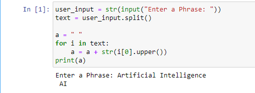

# PYTHON 

Python is a programming language.

Python can be used on a server to create web applications.

# Download Python
Download Python from the official Python web site: [https://python.org](https://python.org)

## What can Python do?
- Python can be used on a server to create web applications.
- Python can be used alongside software to create workflows.
- Python can connect to database systems. It can also read and modify files.
- Python can be used to handle big data and perform complex mathematics.
- Python can be used for rapid prototyping, or for production-ready software development.

## Python Syntax compared to other programming languages
> Python was designed for readability, and has some similarities to the English language with influence from mathematics.
> 
> Python uses new lines to complete a command, as opposed to other programming languages which often use semicolons or parentheses.
> 
> Python relies on indentation, using whitespace, to define scope; such as the scope of loops, functions and classes. Other programming languages often use curly-brackets for this purpose.

### **Example:**
```sh
print("Hello, World!")
```
# Python Install
Many PCs and Macs will have python already installed.

### To check if you have python installed on a Windows PC, search in the start bar for Python or run the following on the Command Line (cmd.exe):
```sh
C:\Users\Your Name>python --version
```
### To check if you have python installed on a Linux or Mac, then on linux open the command line or on Mac open the Terminal and type:
```sh
python --version
```

If you find that you do not have python installed on your computer, then you can download it for free from the following website: [https://www.python.org/](https://www.python.org/)

## Python Quickstart
Python is an interpreted programming language, this means that as a developer you write Python (.py) files in a text editor and then put those files into the python interpreter to be executed.

### The way to run a python file is like this on the command line:
```sh
C:\Users\Your Name>python helloworld.py
```
Where "helloworld.py" is the name of your python file.

```sh
helloworld.py

print("Hello, World!")

```
### The output should read:
```sh
Hello, World!
```

### Whenever you are done in the python command line, you can simply type the following to quit the python command line interface:
```sh
exit()
```

# Python Syntax
## Execute Python Syntax
As we learned in the previous page, Python syntax can be executed by writing directly in the Command Line:
```sh
>>> print("Hello, World!")
Hello, World!
```
## Python Variables
In Python, variables are created when you assign a value to it:
```sh
x = 5
y = "Hello, World!"
```

## Comments
Comments start with a #, and Python will render the rest of the line as a comment:

### Comments in Python:
```sh
#This is a comment.
print("Hello, World!")
```
## Creating Variables
A variable is created the moment you first assign a value to it.

```sh 
x = 5
y = "John"
print(x)
print(y)
```

## Casting
If you want to specify the data type of a variable, this can be done with casting.
### **Example:**
```sh
x = str(3)    # x will be '3'
y = int(3)    # y will be 3
z = float(3)  # z will be 3.0
```

## Get the Type
You can get the data type of a variable with the ```type()``` function.

### **Example:**
```sh
x = 5
y = "John"
print(type(x))
print(type(y))
```

# **example-1:** 
## Acronyms Using Python
```sh
user_input = str(input("enter a phrase: "))
text = user_input.split()

a = " "
for i in text:
    a = a + str(i[0]).upper()
print(a)
```
### Output
```sh
Enter a Phrase: Artificial Intelligence
AI
```


[](https://gist.github.com/facesar/9b9a165e1787cebd7b78376ac44adb61)

# **example-2:**
## Python Program to Remove Odd or Even Numbers From a List

### Below is how we can define a Python function to remove all the odd numbers from a Python list:
```sh
x = [12, 15, 7, 9]

def remove_odd(x):
    for i in x[:]:
       if (i % 2) != 0:
        x.remove(i)
    return x

print(remove_odd(x))
```

### Output
```sh
[12]
```

### Just like the function defined above, below is how we can define a Python function to remove all the even numbers from a Python list:
```sh
y = [12, 15, 7, 9]

def remove_even(x):
    for i in x[:]:
      if (i % 2) == 0:
        x.remove(i)
    return x

print(remove_even(y))
```

### Output
```sh
[15, 7,9]
```

[](https://github.com/facesar/python_codes/blob/master/pyhon_code/remove-odd.ipynb)

# **example-3:**

## Phone Number Details using Python

To install this Python module on your system, you can use the pip command on your terminal or the command prompt mentioned below:
```sh
$ pip install phonenumbers
```
There are a lot of details you can find about a number using this Python module. Here’s how you can find some of the basic details about a phone number using Python:
```sh
import phonenumbers as ph
from phonenumbers import carrier
from phonenumbers import geocoder
from phonenumbers import timezone

number = "+7912xxxxxxx"
number = ph.parse(number)
print(timezone.time_zones_for_number(number))
print(carrier.name_for_number(number, "en"))
print(geocoder.description_for_number(number, "en"))
```

This is how you can use it to find some of the basic details of a phone number. You can read more about this module from [here](https://github.com/facesar/python_codes) to find more complex details about a phone number.